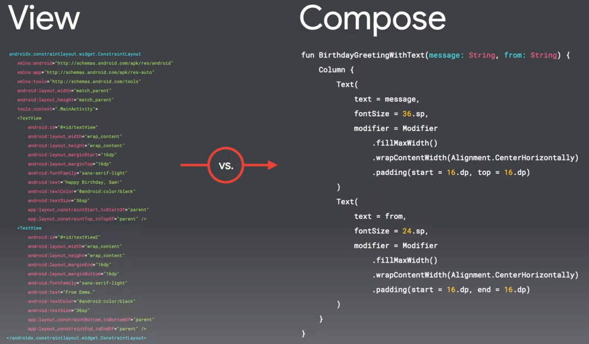
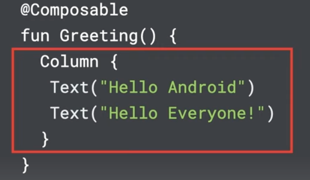
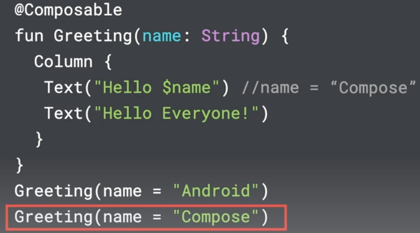

https://developer.android.com/courses/android-basics-compose/course

* goal
  * online course -- to build -- Android apps /
    * best practices
    * -- via -- Jetpack Compose

* [Introduction to programming in Kotlin](https://developer.android.com/courses/pathways/android-basics-compose-unit-1-pathway-1)
  * [quiz answers](https://medium.com/@iamalbertclaude/training-android-basics-with-compose-first-android-app-intro-to-kotlin-4c93cf7cc096)
* [Setup Android Studio](https://developer.android.com/courses/pathways/android-basics-compose-unit-1-pathway-2)
  * Android emulator
    * uses
      * test DIFFERENT
        * Android API levels
        * devices (phones, tablets, TVs, ..)
    * Tools, Device manager
      * if downloadable link appears == NOT installed | your computer -> you need to download it
  * Connect a real Android devices
    * turn on developer option
    * ways
      * usb
        * enable debugging option
      * wifi
        * enable wireless option
    * usb
* [Build a basic layout](https://developer.android.com/courses/pathways/android-basics-compose-unit-1-pathway-3)
  * Kotlin
    * SAME language for building
      * UI
      * app's behavior
  * View vs Compose
  
    
  * Jetpack Compose
    * built-in layouts
      * basic ones are: `Column`, `Row`, `Box`
    
        
    * UI component 
      * == EACH element / displayed
        * _Example:_ text, images, buttons, ..
      * == function / 
        * annotated with `@Composable`
        * return `Unit` == nothing
        * can receive parameters
        * 👀naming rules👀
          * -- following -- Pascal case
          * MUST be a noun -- `DoneButton()` --
          * NOT a 
            * verb or verb phrase -- `DrawTextField()` --
            * nouned preposition -- `TextFieldWithLink()` --
            * adjective -- `Bright()` --
            * adverb -- `Outside()` --
          * CAN be prefixed -- by -- descriptive adjectives -- `RoundIcon()` --
          * see [API Guidelines](https://github.com/androidx/androidx/blob/androidx-main/compose/docs/compose-api-guidelines.md#naming-unit-composable-functions-as-entities)
        * immutables
          * == once the UI component is created -> can NOT be changed
        * recomposition
          * := process / state changes -> Android automatically re-executes the Composable

        
      * if the size of the father > sum of its children sizes -> you can arrange it
        * _Example:_ `Column.verticalArrangement` or `Column.horizontalArrangement` 
    * declarative UI approach
    * `modifier`
      * uses 
        * | Composable functions -- to pass -- arguments from parent -- to -> children elements
        * | UI elements -- to -- decorate or add behavior
          * _Example:_ padding,
    * units of measure
      * Scalable pixels
        * `sp`
        * see [documentation](https://developer.android.com/reference/kotlin/androidx/compose/ui/unit/package-summary#(kotlin.Float).sp())
      * Device-independent pixels
        * `dp`
        * see [documentation](https://developer.android.com/reference/kotlin/androidx/compose/ui/unit/package-summary#(kotlin.Int).dp())
    * `@Preview`
      * preview the composable function
    * TODO:
  * Android Studio
    * Tool, Resource Manager -- see [documentation](studio.write.resource-manager.md) --
  * 👀if you resize images / larger than the Android system can handle -> throw an OOM error 👀
    * see [image customization](develop.ui.compose.graphics.images.customize.md)
* see 
  * [this GitHub repo](https://github.com/dancer1325/android-kotlin-compose-first-app)
  * [this another GitHub repo](https://github.com/dancer1325/basic-android-kotlin-compose-training-practice-problems)
* TODO: