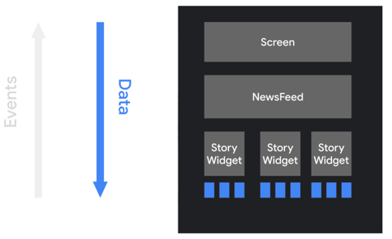

https://developer.android.com/develop/ui/compose/mental-model

* goal
  * 💡Compose's declarative approach != View-based approach💡

* declarative API
  * -- provided by -- Jetpack Compose
  * allows
    * rendering your app UI / WITHOUT mutating FE views

* declarative UI model
  * makes easier
    * build UI
    * update UI 
      * != manually update a stateful view hierarchy 
  * how does it work?
    * regenerate the entire screen -- from -- scratch / apply ONLY the necessary changes
      * cons
        * potentially expensive (about computing power, and battery usage) -> ONLY applied | NECESSARY parts 

* Composable functions
  * emit UI hierarchy -- by calling -- OTHER composable functions
    * BUT WITHOUT returning anything -- Reason: 🧠declarative UI model 🧠 --

* Android view hierarchy
  * == tree of UI widgets
    * is updated -- based on -- changes of state of the app (_Example:_ user interactions) / display the current data 
    * legacy view approach
      * if you want to update the widgets
        * steps
          * walk the tree -- via -- `findViewById()`
          * change nodes -- via -- `button.setText(String)`, `container.addChild(View)`, or `img.setImageBitmap(Bitmap)` 
        * error prone 
          * as MORE views -> MORE likelihood to errors 
          * _Examples:_
            * _Example1:_ if a piece of data is rendered | multiple places -> you need to update ALL == easy to forget to update one 
            * _Example2:_ if 2 updates conflict in an unexpected way -> create illegal states  
            * _Example3:_ set a value of a node / was just removed | UI
      * == imperative object-oriented UI toolkit
        * if you want to initialize the UI -> instantiate a tree of widgets
          * -- via -- inflating an XML layout file
          * / EACH widget
            * maintains its own internal state
            * exposes getter and setter methods -- to interact with the -- widget
    * Compose's declarative approach
      * widgets
        * relatively stateless
        * NOT expose setter or getter functions
          * widgets are NOT exposed as objects
      * if you want to update the widgets
        * call the SAME composable function -- with -- DIFFERENT arguments 
          * == easy to provide state to architectural patterns -- _Example:_ `ViewModel` --
        * | ANY time the observable data updates -> your composables -- are responsible, for -- transforming the current application state -- into a -> UI
      * way to populate with data your app
        * app logic -- provides data to the -- top-level composable function
        * those top-level composable functions -- passes the -- appropriate data | those composables & down the hierarchy
        
        
      * way the user -- interacts with the -- UI
        * UI raises events -- _Example:_ `onClick` --
        * Those events -- should notify the -- app logic / change the app's state
        * WHEN the state changes -> the composable functions -- are called again with the -- NEW data
          * -> UI elements are redrawn -- recomposition process -- 

        

* Dynamic Content
  * available | Compose approach (NOT | View-approach)
    * Reason: 🧠 written in Kotlin 🧠
  * _Example:_ `ThinkingInComposeSnippets.kt`

* recomposition
  * | imperative UI model
    * if you want to change a widget (== change its internal state) -> call a setter | widget
  * | Compose
    * 👀if you want to change a widget -> call the composable function AGAIN -- with -- NEW data == recomposition 👀
      * 💡== function is recomposed💡
        * if necessary -> widgets / emitted by the function & ONLY those / changed, -- are redrawn with -- NEW data
      * "AGAIN" == as often as EVERY frame
      * _Example:_ `ThinkingInComposeSnippets.kt`
      * 👀execute composable functions
        * -- NEVER depend on -- side-effects👀 
          * Reason: 🧠 function's recomposition -- may be -- skipped 🧠 
          * if you do -> users -- may experience -- strange & unpredictable behavior | your app
          * _Example:_ dangerous side-effects
            * write to a shared object's property 
            * update
              * ViewModel's observable 
              * shared preferences
        * should be fast
          * Reason: 🧠avoid jank🧠
          * if you need to do expensive operations (_Example:_ `ThinkingInComposeSnippets.kt`) ->
            * do it | background coroutine
            * pass the value result -- to the -- composable function's parameter
    * recomposition
      * skips as MANY composable functions and lambdas as POSSIBLE
        * TODO:
      * is optimistic and MAY be canceled
        * TODO:
    * composable functions
      * MIGHT be run quite FREQUENTLY (as often as EVERY frame of an animation)
        * TODO:
      * can execute in
        * parallel
          * TODO:
        * ANY order
          * TODO:

* https://www.youtube.com/watch?v=4zf30a34OOA
  * == [article](https://medium.com/androiddevelopers/thinking-in-compose-c4ef150bb7cf)
  * Views
    * describe your UI look step by step
      * steps
        * define them -- via -- .xml
        * if user interacts with your view -> 
          * find Views -- from -- code
          * specify the behavior | your UI -- via -- `setter()`
    * cons
      * handle manually update Views is error prone
        * Reason: 🧠you can forget to update a View 🧠
  * Compose
    * how does UI components work?
      * declare what you want
      * if screen needs to change -> redeclare ALL what you want
    * UI elements
      * == functions
      * != objects
        * -> you can NOT
          * find reference to them or
          * call methods -- to -- mutate
    * State and events in Compose
      * TODO:
  * Views vs Compose
    * 💡construct UI from how (| View) -> what (| Compose)💡
    * way to define UI elements
      * xml | View vs Kotlin | Compose
  * _Example:_ see [githubRepo](https://github.com/dancer1325/android-jetpackcompose-samples/tree/v2024.05.00/Jetsurvey)