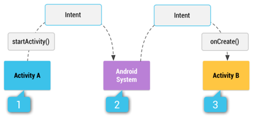

https://developer.android.com/guide/components/intents-filters

* TODO:

# Intent types
* types of intents
  * **Explicit intents**
    * specify the application's component / satisfy the intent
      * -- via specifying a -- FULL `ComponentName`
    * use cases
      * start a component | your own app
        * Reason: 🧠 you know the class name of the activity or service / you want to start 🧠 
    * _Example1:_ start a NEW activity | your app -- in response to a -- user action
    * _Example2:_ start a service -- to download a -- file | background
  * **Implicit intents**
    * NOT name a specific component
    * 👀declare a general action -- to -- perform / allows another app's component can handle it 👀 
    * _Example1:_ you want to show the user a location | map -> you can request that another capable app -- via implicit intent -- show a specified location | map
    * _Example2:_ implicit intent -- to start -- another activity
      
      

      * implicit intent -- ,through the system, to start -- ANOTHER activity
        * [1] Activity A -- creates an -- Intent /
          * with an action description
          * -- passes it to -- `startActivity()`
        * [2] Android System -- searches -- ALL apps / matches the intent vs intent filter
        * [3] once there are
          * 1! match found -> system -- starts the -- matching activity (Activity B)
            * -- by invoking -- its `onCreate()`
            * -- passing it the -- Intent
          * \>=1 intent filters compatible -> system displays a dialog / user can pick which app to use
* intent filter
  * 👀== expression | app's manifest / specifies the type of intents / component -- would like to -- receive 👀
    * _Example:_ declare an intent filter | activity -> enable other apps -- can directly start, via certain kind of intent, -- your activity
  * ⚠️if you do NOT declare ANY intent filters | activity -> it can be started ONLY -- via an -- explicit intent ⚠️

* recommendations
  * use an explicit intent | starting a Service & NOT declare intent filters | your services
    * Reason: 
      * 🧠ensure / your app is secure 🧠
      * use an implicit intent | start a service is a security hazard
        * Reason: 🧠
          * you can NOT be certain the service / -- will respond to the -- intent
          * user can NOT see WHICH service starts
        * | Android v5.0+ (API level v21+), if you call `bindService()` -- via -- implicit intent -> system throws an exception 

# Building an intent
* TODO:

# Receiving an implicit intent
* TODO:

# TODO: