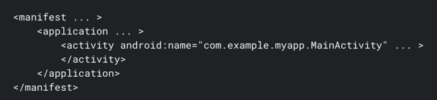

https://developer.android.com/guide/topics/manifest/manifest-intro

* see [fundamental](guide.components.fundamentals.md#androidmanifestxml)
* if you use Android Studio -> created automatically

# File features
* declare [app's components](guide.components.fundamentals.md#app-components)
  * [`<activity>`](https://developer.android.com/guide/topics/manifest/activity-element) / EACH subclass of Activity
  * [`<service>`](https://developer.android.com/guide/topics/manifest/service-element) / EACH subclass of Service
  * [`<receiver>`](https://developer.android.com/guide/topics/manifest/receiver-element) / EACH subclass of BroadcastReceiver
  * [`<provider>`](https://developer.android.com/guide/topics/manifest/provider-element) / EACH subclass of ContentProvider

* ⚠️if you declare ANY app's component subclas BUT NOT declared | `AndroidManifest.xml` -> system can NOT start it ⚠️ 

* `<component android:name="ComponentSubclassName"`
  * `ComponentSubclassName`
    * can be
      * `full path`
    
        

      * if you specify the variant [`namespace`](https://developer.android.com/reference/tools/gradle-api/7.1/com/android/build/api/variant/Variant#namespace) | project -> that can be skipped

        

* [Intents & Intent Filters](training.basics.intents.md)

* Icons and labels
  * == `<manifestElement android:icon` & `<manifestElement android:label`
    * SEVERAL manifest elements have `icon` & `label`
    * allows displaying | corresponding app component, a 
      * small icon -- `icon` --
      * text label -- `label` --
  * 👀if they are set | parent element -> default one | ALL child elements 👀 
  * 👀if they are set | component's `<intent-filter>` -> displayed | component == option -- to fulfill an -- intent👀

## Permissions
* TODO:

# File conventions
* TODO:

# Manifest elements reference
* TODO:

# Limits
* TODO:

# Example
* TODO: