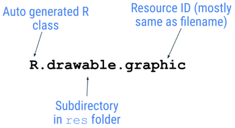
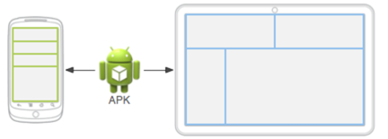
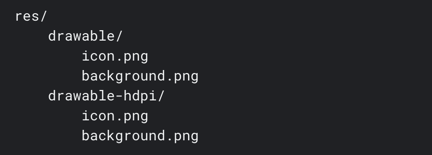

https://developer.android.com/guide/topics/resources/providing-resources

* Resources
  * == additional files + static content
    * _Example:_ bitmaps, layout definitions, UI strings, animation instructions, ...
  * uses
    * 👀by your code | runtime 👀
      * _Example1:_ different UI layout -- based on the -- screen size
      * _Example2:_ different strings -- based on the -- language setting   
  * use cases
    * externalize app resources 
      * Reason: 🧠maintain them independently🧠
    * alternative resources / specific device configurations
      * -> group them | named resource directories
  * way to access them
    * 👀use resource IDs / generated | your project's `R` class 👀

* `R` class
  * == class / 
    * -- automatically generated by -- Android
    * contains the IDs of ALL resources | project
      * resource ID == (NORMALLY) filename

    

# Group resource types
* your project's `res/`
  * PLACE | store your resources / organized in subdirectories (👀specific names👀)
    * `animator/`
      * == .xml / define Property animations
    * `anim/`	
      * == .xml / define Tween animations
      * Property animations can ALSO be saved | this directory
    * `color/`
      * == .xml / define a state list of colors
    * `drawable/`
      * == .xml or bitmap files (.png, .9.png, .jpg, .gif)
    * `mipmap/`
      * == drawable files / DIFFERENT launcher icon densities
    * `layout/`
      * == .xml / define a UI layout
    * `menu/`
      * == .xml / define app menus (_Example:_ options menu, context menu, or submenu)
    * `raw/`
      * == arbitrary files / saved | their raw form
        * if you want to open them -> use `Resources.openRawResource()`
      * if you need original filenames & file hierarchy -> save | `assets/`
    * `values/`
      * == .xml / contain simple values (_Example:_ `strings.xml`, `arrays.xml`, `colors.xml`, ...)
    * `xml/`
      * == arbitrary .xml / if you want to read | runtime -> call `Resources.getXML()`
    * `font/`
      * == font files /
        * available extensions TTF, OTF, or TTC, or XML files
        * include a `<font-family>` element
  * _Example:_ file hierarchy for a simple project
  
    

# Provide alternative resources / specific devices
* _Example:_

    

* rules to specify configuration-specific alternatives
  * create new directory `res/resourceName-qualifier/`
    * `resourceName` == AVAILABLE resource types
    * `qualifier`
      * 👀follow [Table 2 convention](https://developer.android.com/guide/topics/resources/providing-resources)👀
  * save the resource | directory recently created /
    * ⚠️resource file name == default resource file name ⚠️
      * _Example:_ 

        

## Qualifier name rules
* TODO:

# Provide alternative resources
* TODO: