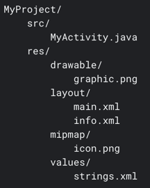

https://developer.android.com/guide/topics/resources/providing-resources

* Resources
  * == additional files + static content
    * _Example:_ bitmaps, layout definitions, UI strings, animation instructions, ...
  * uses
    * by your code | runtime
      * _Example1:_ different UI layout -- based on the -- screen size
      * _Example2:_ different strings -- based on the -- language setting   
  * use cases
    * externalize app resources 
      * Reason: 🧠maintain them independently🧠
    * alternative resources / specific device configurations
      * -> group them | named resource directories
  * way to access them
    * use resource IDs / generated | your project's `R` class 

# Group resource types
* your project's `res/`
  * PLACE | store your resources / organized in subdirectories (specific names)
    * `animator/`
      * == .xml / define Property animations
    * `anim/`	
      * == .xml / define Tween animations
      * Property animations can ALSO be saved | this directory
    * `color/`
      * == .xml / define a state list of colors. For more information, see Color state list resource.
  * _Example:_ file hierarchy for a simple project
  
    

  * The res/ directory contains all the resources in its subdirectories: an image resource, two layout resources, a mipmap/ directory for launcher icons, and a string resource file. 
  * 👀resource directory names are important & specific ones👀 

# Provide alternative resources
* TODO: