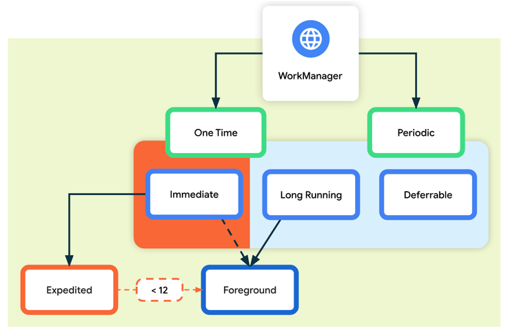

https://developer.android.com/topic/libraries/architecture/workmanager

* `androidx.work.WorkManager`
  * 👀recommended solution for 👀
    * persistent work
    * background processing
      * Reason: 🧠 MOST background processing -- is best accomplished through -- persistent work 🧠
  * features
    * TODO:

* persistent Work
  * remains scheduled | ALTHOUGH app restarts & system reboots
  * types
    * Immediate
      * == tasks / MUST
        * begin immediately
        * complete soon
          * -> run 1!
      * -- may be -- expedited
      * ways to access
        * `OneTimeWorkRequest`
          * if it's expedited -> call `.setExpedited()`
        * `Worker`
    * Long Running
      * == tasks / might run for longer than 10'
      * run
        * 1! or
        * periodic
      * ways to access
        * `WorkRequest`
        * `Worker`
          * if you want to handle the notification -> call `setForeground()`
    * Deferrable
      * == scheduled tasks /
        * start at a later time
        * can run periodically
      * run
        * 1! or
        * periodic
      * ways to access
        * `PeriodicWorkRequest`
        * `Worker`
    
    
